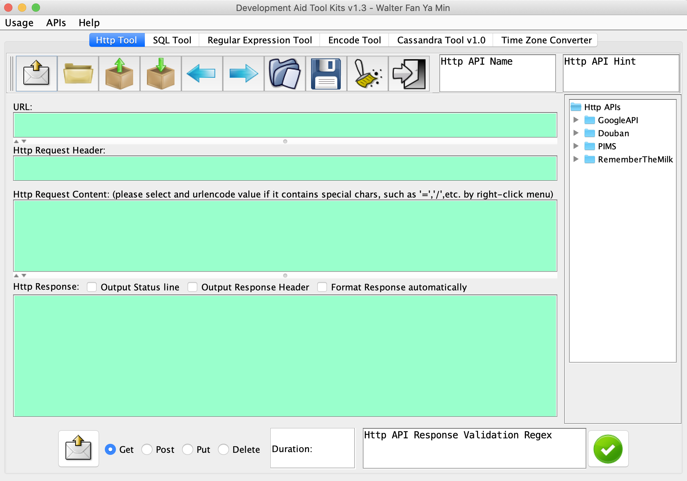
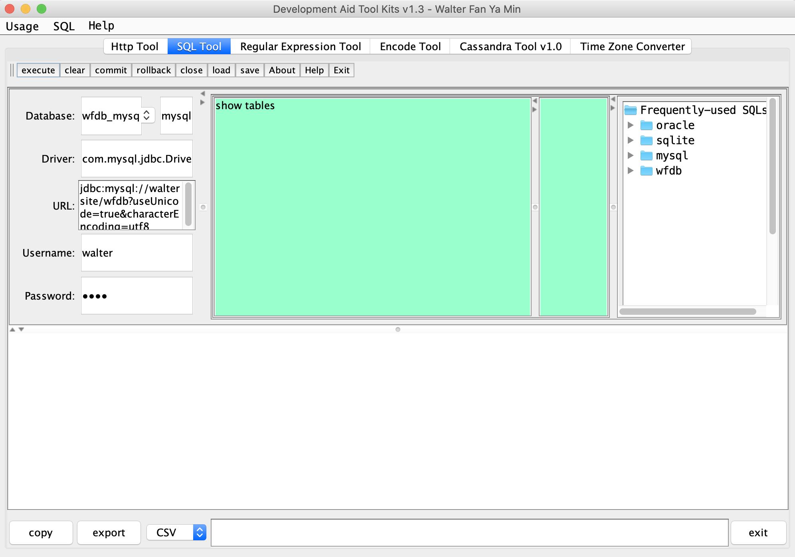
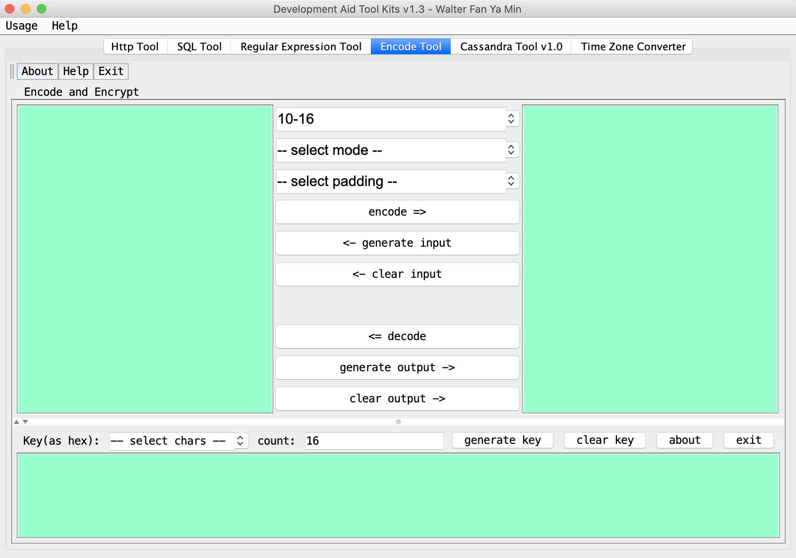
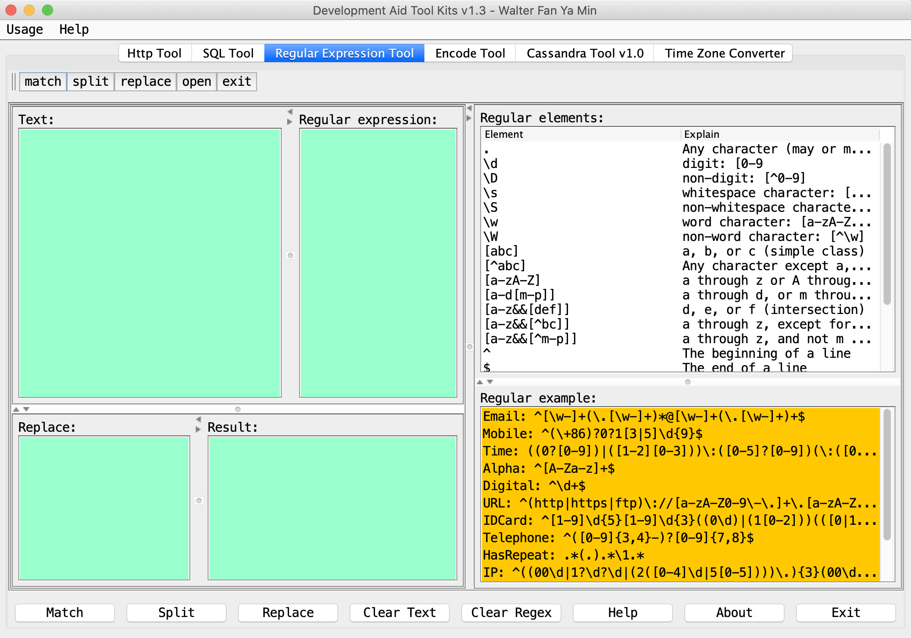

Developer Aid Toolkit 1.0
-----------------------------

## Swing based tool
* Http Tool

* SQL Tool

* Encode conversion Tool

* Regular Expression Tool

## Web based tool
* bookmark
* manual
* snippet

# Some useful scripts
* batch execution: script/batch.py
* search and list/delete: script/searchfile.py 

# Prerequisites
* Install JDK 1.6 or above
* Install Maven 2 or above
* Python 2.5 above

# Execution
## Steps
* 1) mvn package
* 2) java -jar ./target/devaid-1.0-jar-with-dependencies.jar

# License
---------------------------------------
    Copyright 2013 Walter Fan

    Licensed under the Apache License, Version 2.0 (the "License");
    you may not use this file except in compliance with the License.
    You may obtain a copy of the License at

       http://www.apache.org/licenses/LICENSE-2.0

    Unless required by applicable law or agreed to in writing, software
    distributed under the License is distributed on an "AS IS" BASIS,
    WITHOUT WARRANTIES OR CONDITIONS OF ANY KIND, either express or implied.
    See the License for the specific language governing permissions and
    limitations under the License.

Thanks for using it
Walter Fan
